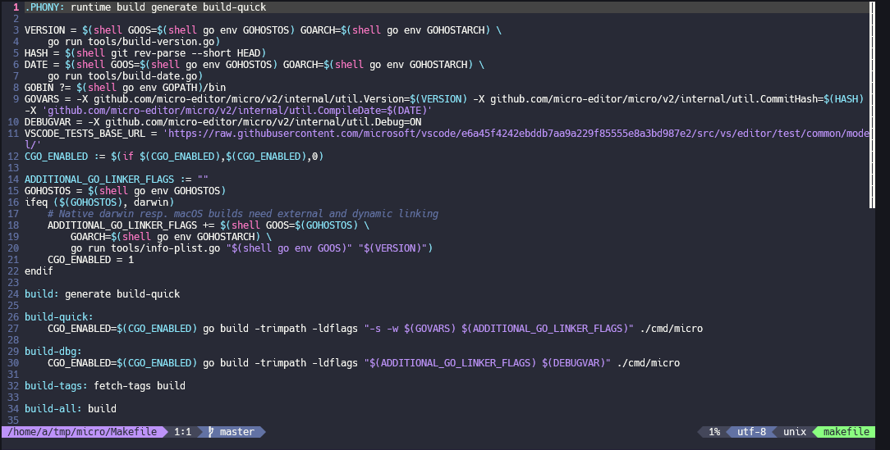

# micro-powerline
A powerline patch, plugin and colorscheme for the Micro Editor [Micro Editor](https://duckduckgo.com](https://github.com/micro-editor/micro).

This will patch will work for 2.0.16-dev.44 version of Micro pulled from github. The patch will only patch statusline.go and add the ability to have multiple colors and segments in the statusline.

To function it also needs the powerline plugin and a modified colorscheme. I have included a colorscheme based on the dracula colorscheme.

# Install
Pull the Micro github repo:
https://github.com/micro-editor/micro

Pull this repo and place the files into the micro directory.
Then run install.sh which will patch statusline.go and copy plugin and colorscheme to the correct directories.
After that you run "make build" in the micro directory and compiled the patched version.

